# Урок 2. Механизмы контрольных групп

---

## Задание 1:
1) запустить контейнер с ubuntu, используя механизм LXC
2) ограничить контейнер 256 Мб ОЗУ и проверить, что ограничение работает
3) добавить автозапуск контейнеру, перезагрузить ОС и убедиться, что контейнер действительно запустился самостоятельно
4) при создании указать файл, куда записывать логи
5) после перезагрузки проанализировать логи

## Задание 2*: 
* настроить автоматическую маршрутизацию между контейнерами. Адреса можно взять: 10.0.12.0/24 и 10.0.13.0/24.


---

### Решение задачи 1.1:

* Запустить контейнер с ubuntu, используя механизм LXC

Установка LXC и LXD:

```sudo apt update```

```sudo apt install lxc```

```sudo apt install lxc-templates```

```sudo apt install lxd-installer```

---

Необходимо настроить LXC, для этого нужно инициализировать lxd (который мы ранее установили вместе с LXC).

```sudo lxd init```

При настройке лучше выбрать стандартные параметры, каждый раз нажимая Enter

Проверим правильность установки командой:

```lxc version```

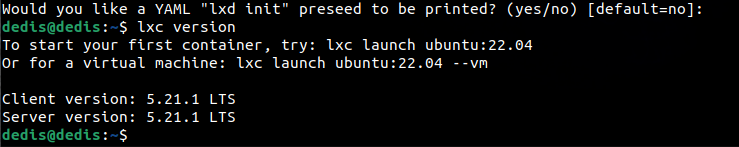

---

Создаем контейнер с именем firstCont:

```sudo lxc-create -n firstCont -t ubuntu```

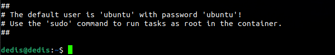
Этот текст говорит нам, что контейнер создался. И о том, что логин и пароль от него - ubuntu

---

Запуск контейнера:

```sudo lxc-start -d -n firstCont```

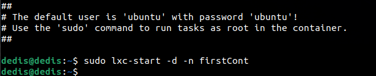
Если нет уведомления об ошибках, то контейнер запустился.
Еще один способ проверить, это команда:
```sudo lxc-ls -f```

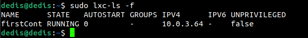
Параметр STATE - RUNNING указывает на то, что контейнер запущен.

Попробуем войти в него:

```sudo lxc-attach -n firstCont```

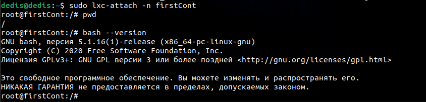
Убедились в том, что мы находимся в контейнере, с помощью команд pwd и bash --version.

---

### Решение задачи 1.2:

* Ограничить контейнер 256 Мб ОЗУ и проверить, что ограничение работает

Для начала выйдем из контейнера (команда ```exit```), приостановим его(команда ```sudo lxc-stop -n firstCont```), и изменим конфиг контейнера.

```sudo nano /var/lib/lxc/firstCont/config```

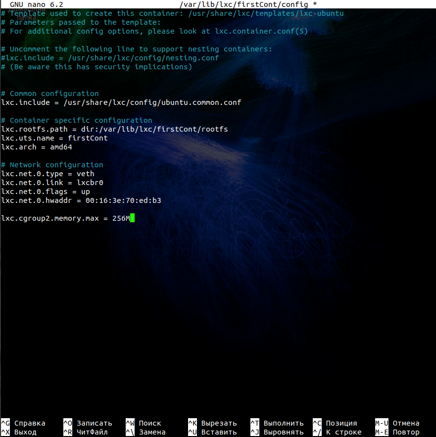

В конце конфигурационного файла добавим параметр 
```lxc.cgroup2.memory.max = 256M```

Который означает, что мы ограничили память до 256M.

Проверим это. Запускаем наш контейнер и заходим в него.

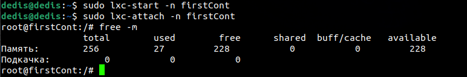
С помощью команды ```free -m``` проверяем потребляемое количество памяти.

---

### Решение задачи 1.3:

* Добавить автозапуск контейнеру, перезагрузить ОС и убедиться, что контейнер действительно запустился самостоятельно

Также выйдем из контейнера (команда ```exit```), приостановим его(команда ```sudo lxc-stop -n firstCont```), и изменим конфиг контейнера.

```sudo nano /var/lib/lxc/firstCont/config```

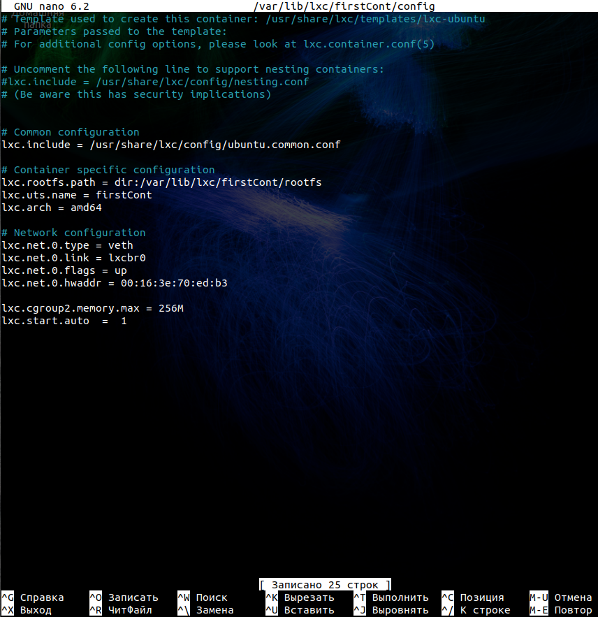
В конце конфигурационного файла добавим параметр 
```lxc.start.auto  =  1```

Который означает, что мы добавили параметр автозагрузки контейнера.

Проверим это. Вспомним команду ```sudo lxc-ls -f```, ранее в которой параметр AUTOSTART был 0.

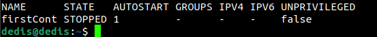
Теперь же параметр равен одному, это означает, что автозагрузка работает.

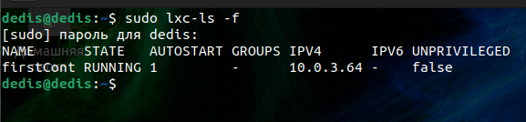
Перезагрузил ОС, запустился контейнер хотя я его не запускал. Команда - ```sudo lxc-ls -f```

---

### Решение задачи 1.4:

* при создании указать файл, куда записывать логи

Запуск с записью лога в файл /var/log/lxc.log

```lxc-start --logfile=/var/log/lxc.log -d -n firstCont```


---

### Решение задачи 1.5:

* после перезагрузки проанализировать логи

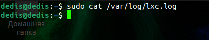